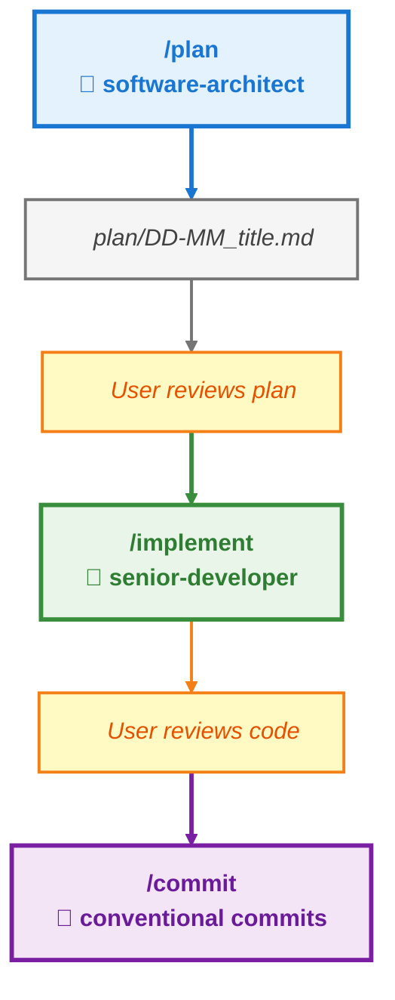

# AI Agents Configuration

This repository contains my personal configuration for AI agents.

## Installation

### Clone Repository

```bash
# Clone this repository
git clone https://github.com/OscSer/agents-config.git

# Navigate to the folder
cd agents-config
```

### Quick Installation

```bash
# Run the installation script
python3 install.py
```

> ⚠️ **Important**: The installation script creates symbolic links to this repository. This means that any existing configuration files will be **replaced**. If you want to preserve your existing configuration, you can copy the files manually instead of running the script.

### Manual Installation

#### Claude Code

```bash
# Copy Claude Code agents
cp -r claude/agents/* ~/.claude/agents/

# Copy Claude Code commands
cp -r claude/commands/* ~/.claude/commands/

# Copy Claude Code configuration
cp claude/settings.json ~/.claude/settings.json

# Copy shared AGENTS.md
cp common/AGENTS.md ~/.claude/AGENTS.md
```

Copy the `claude/.mcp.json` file to your project, or manually add the MCP servers to your `~/.claude.json` file.

#### OpenCode

```bash
# Copy OpenCode agents
cp -r opencode/agents/* ~/.config/opencode/agents/

# Copy OpenCode configuration
cp opencode/settings/config.json ~/.config/opencode/config.json

# Copy shared AGENTS.md
cp common/AGENTS.md ~/.config/opencode/AGENTS.md
```

## Structure

```
├── claude/
│   ├── agents/               # Claude Code specialized agents
│   ├── commands/             # Claude Code slash commands
│   ├── templates/            # Claude Code templates
│   ├── settings.json         # Claude Code configuration
│   └── .mcp.json             # Claude Code MCP servers
├── opencode/
│   ├── agents/               # OpenCode specialized agents
│   ├── templates/            # OpenCode templates
│   └── settings/
│       └── config.json       # OpenCode configuration
├── common/
│   └── AGENTS.md             # Shared agent instructions
└── install.py                # Automatic installation script
```

## Workflow


