# Claude Code - Personal Configuration

This repository contains my personal configuration for Claude Code.

## Installation

To copy this configuration to your system:

```bash
# Clone this repository
git clone https://github.com/OscSer/claude-code-config.git

# Navigate to the folder
cd claude-code-config

# Copy custom agents
cp -r agents/ ~/.claude/agents/

# Copy custom commands
cp -r commands/ ~/.claude/commands/

# Copy main configuration
cp settings/settings.json ~/.claude/settings.json
```

## Structure

- `agents/` - Custom specialized agents
- `commands/` - Custom slash commands
- `settings/` - Configuration files
  - `settings.json` - Main Claude Code configuration

## Workflow

```mermaid
flowchart TD
    Start[("🚀 Development Task")] --> Plan["/plan [request]"]
    
    Plan --> PlanOutput["📋 plan/DD-MM_title.md"]
    PlanOutput --> Implement["/implement [plan_file]"]
    
    Implement --> ImplResult{"Implementation Complete?"}
    ImplResult -->|"Yes"| Review["/code-review"]
    ImplResult -->|"No"| Debug["🐛 Debug & Fix"]
    Debug --> Implement
    
    Review --> ReviewOK{"Review Passed?"}
    ReviewOK -->|"Yes"| Commit["/commit"]
    ReviewOK -->|"No"| Fix["🔧 Apply Fixes"]
    Fix --> Review
    
    Commit --> Done[("✅ Task Complete")]
    
    %% Direct workflow for simple tasks
    Start --> SimpleImpl["Direct Implementation"]
    SimpleImpl --> Commit
    
    %% Standalone review
    Code["📁 Existing Code"] --> StandaloneReview["/code-review"]
    StandaloneReview --> ReviewReport["📊 Quality Report"]
    
    %% Styling
    style Plan fill:#e1f5fe,stroke:#01579b,stroke-width:2px
    style Implement fill:#e8f5e8,stroke:#2e7d32,stroke-width:2px
    style Review fill:#fce4ec,stroke:#c2185b,stroke-width:2px
    style Commit fill:#fff3e0,stroke:#ef6c00,stroke-width:2px
    
    style Start fill:#f3e5f5,stroke:#7b1fa2,stroke-width:3px
    style Done fill:#e8f5e8,stroke:#388e3c,stroke-width:3px
```


