# Claude Code - Personal Configuration

This repository contains my personal configuration for Claude Code.

## Installation

### Clone Repository

```bash
# Clone this repository
git clone https://github.com/OscSer/claude-code-config.git

# Navigate to the folder
cd claude-code-config
```

### Quick Installation

```bash
# Run the installation script
./install.sh
```

### Manual Installation

```bash
# Copy custom agents
cp -r agents/* ~/.claude/agents/

# Copy custom commands
cp -r commands/* ~/.claude/commands/

# Copy main configuration
cp settings/settings.json ~/.claude/settings.json
```

## Structure

- `agents/` - Custom specialized agents
- `commands/` - Custom slash commands
- `settings/` - Main Claude Code configuration files
- `templates/` - Development templates for creating new agents and commands

## Command Workflows

```mermaid
flowchart TD
    %% Top level commands at same level
    subgraph " "
        Plan["/plan<br/>📋 planner agent"]
        Fix["/fix<br/>🐛 debugger agent"]
    end

    %% Development workflow
    Plan --> PlanFile["📄 plan/DD-MM_title.md"]
    PlanFile --> Review["👤 User reviews<br/>and adjusts plan"]
    Review --> Implement["/implement<br/>⚙️ implementer agent"]

    %% Fix workflow
    Fix --> AutoImplement["⚙️ Auto-implement<br/>(implementer agent)"]

    %% Align implementer agents at same level
    subgraph " "
        Implement
        AutoImplement
    end

    %% Common endpoints
    Implement --> CodeReview["/review<br/>🔍 reviewer agent"]
    AutoImplement --> CodeReview
    CodeReview --> Commit["/commit<br/>📝 conventional commits"]

    %% Command styles with rounded corners and shadows
    style Plan fill:#e3f2fd,stroke:#1976d2,stroke-width:3px,color:#1976d2,font-weight:bold
    style Implement fill:#e8f5e8,stroke:#388e3c,stroke-width:3px,color:#2e7d32,font-weight:bold
    style Fix fill:#fff3e0,stroke:#f57c00,stroke-width:3px,color:#ef6c00,font-weight:bold
    style CodeReview fill:#fce4ec,stroke:#d32f2f,stroke-width:3px,color:#c2185b,font-weight:bold
    style Commit fill:#f3e5f5,stroke:#7b1fa2,stroke-width:3px,color:#6a1b9a,font-weight:bold

    %% File style
    style PlanFile fill:#f5f5f5,stroke:#757575,stroke-width:2px,color:#424242,font-style:italic

    %% User action style
    style Review fill:#fff9c4,stroke:#f57f17,stroke-width:2px,color:#e65100,font-style:italic

    %% Auto-implement style
    style AutoImplement fill:#e8f5e8,stroke:#388e3c,stroke-width:2px,color:#2e7d32,font-style:italic

    %% Link styles
    linkStyle 0 stroke:#1976d2,stroke-width:3px
    linkStyle 1 stroke:#757575,stroke-width:2px
    linkStyle 2 stroke:#388e3c,stroke-width:3px
    linkStyle 3 stroke:#f57c00,stroke-width:3px
    linkStyle 4 stroke:#388e3c,stroke-width:3px
    linkStyle 5 stroke:#388e3c,stroke-width:3px
    linkStyle 6 stroke:#d32f2f,stroke-width:3px
```


